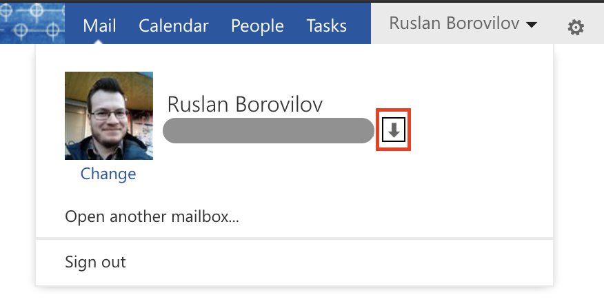
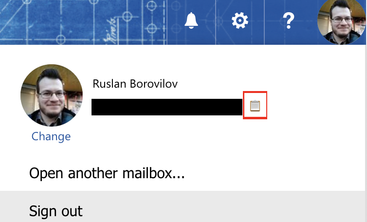
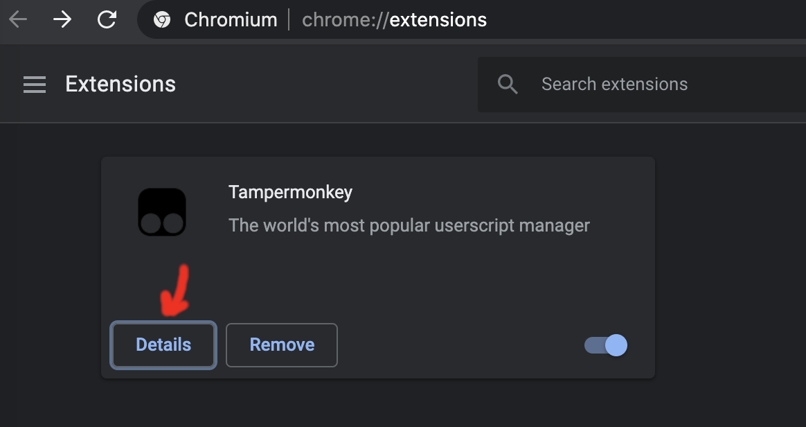
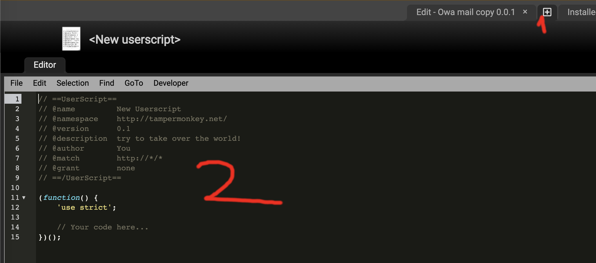

# owa-mail-copy
User script for easy copy of your e-mail adress in Outlook Web App

## How it works:
Pretty simple, you got this button to get you e-mail in clickboard by clicking on it:

### For old version of OWA (only old version screen, but it works simularly):



### For new version of OWA:



## Install guide
1. Install [Tampermonkey](https://www.tampermonkey.net/) for browser of your choice.
2. Install script by clicking on this [link](https://raw.githubusercontent.com/Pycz/owa-mail-copy/main/owa_mail_copy.user.js).
3. ???
4. PROFIT!

## Feedback and contribution
I didn't spend much time on this and this user script may be not perfect,
but it works for me and
all feedback and contribution is appreciated.
Feel free to make issues and pull requests!

### How to setup development envirenment?
1. Install [Tampermonkey](https://www.tampermonkey.net/) for browser of your choice. (Actually for development Chrome is better, because of next point, Firefox doesn't really work)
2. Go to [extensions settings page](chrome://extensions), click "Details" on "Tampermonkey"

3. Enable "Allow access to file URLs" toggle

4. Copy `owa_mail_copy_dev.user.js.example` into `owa_mail_copy_dev.user.js` for local development
    ```bash
    cp owa_mail_copy_dev.user.js.example owa_mail_copy_dev.user.js
    ```
5. Modify `owa_mail_copy_dev.user.js` for your purposes -
   Edit `@require` directive with `file://` address to main `owa_mail_copy.user.js`
   **For example:**
   ```
   @require     file:////Users/ruslan.borovilov/ws/owa-mail-copy/owa_mail_copy.user.js
   ```
6. Install `owa_mail_copy_dev.user.js` to Chrome Tampermonkey by creating of new script and pasting `owa_mail_copy_dev.user.js` content here.

7. And that't it, I guess. Now after saveing of `owa_mail_copy.user.js` new version of script will work after browser page reload.
